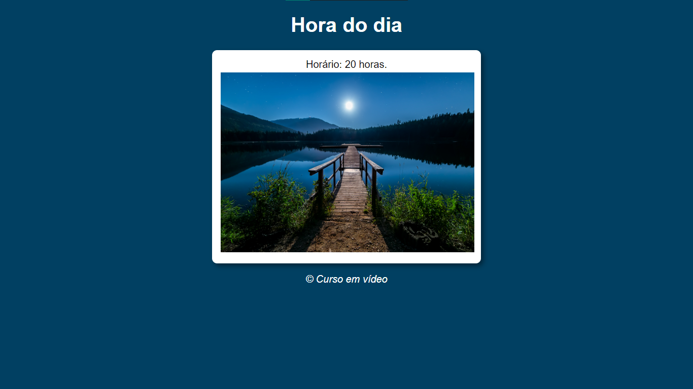

### Curso básico de JavaScript 

Curso básico de JavaScript gratuito disponibilizado pelo canal do Youtube [Curso em Video](https://youtube.com/playlist?list=PLntvgXM11X6pi7mW0O4ZmfUI1xDSIbmTm).

## Projetos

Alguns dos projetos desenvolvidos no curso foram:

1. Uma página que muda de aparência acordo com o horário do dia informado.

    

2. Uma página que recebe o ano de nascimento e calcula a sua idade.

    
